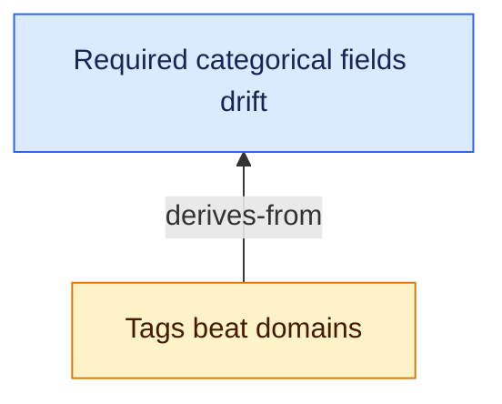

# Verbs

Every corpus verb below takes `--root <DIR>`, `--json` and `--no-commit`, and
those flags may appear anywhere on the line — before the verb, after it, or
after the free text of `capture`, `note` and `near`. Under `--json`, each emits
one JSON value on stdout. The separate `completions` command is the sole
exception: it always emits a shell script. Ids are slugs of the title
(`"Tags beat domains"` → `tags-beat-domains`); inbox ids are four hex chars. A
slug over 60 characters is cut at the last `-` at or before the limit, never
mid-word. `promote` and `new` take `--id <SLUG>` to choose the id explicitly
instead — useful for a long title, since ids are frozen by invariant once
written. An explicit id follows the same slug rules (lowercase words joined
by single dashes, 60 characters or fewer) and is refused, as a typed error,
if it breaks those rules or collides with an existing node.
The `--json` excerpts below are real output from a three-node fixture corpus.

## Corpus

| verb | does | flags |
|---|---|---|
| `neb init [PATH]` | create an empty corpus without changing the machine default | `--set-root`, `--force` (requires `--set-root`) |
| `neb check` | run the ten invariants; exit non-zero on any error | — |
| `neb migrate` | v1 → v2 in place; idempotent; refuses on a dirty git tree | — |
| `neb config observatory-root [DIR]` | read or set where the Observatory checkout is | — |
| `neb config commit [on\|off]` | read or set whether each write is committed to the corpus's git repository | — |

`config` is the only verb that writes `config.yaml`, and it rewrites the file
whole: the file stays machine-written and is never hand-edited. Without `DIR`
it prints the effective root and which setting supplied it
(`observatory_root` in `config.yaml`, else `$OBSERVATORY_ROOT`, else nothing).

```json
// neb init /Users/you/.nebula --json
{ "root": "/Users/you/.nebula" }
```

Plain `init` never writes `~/.config/nebula/root`. For a primary non-default
corpus, pass `--set-root`; it refuses to replace a setting that names another
corpus unless `--force` is also explicit. Scratch corpora use `--root` and
never `--set-root`.

```json
// neb config observatory-root --json     (source: config | env | unset)
{ "root": "/Users/you/workspace/observatory", "source": "config" }
```

```json
// neb config commit --json
{ "enabled": true }
```

With `commit` on (off by default) and the corpus root inside a git work
tree, every mutating verb ends with one commit of `nodes/`, `inbox/` and
`config.yaml`, named `neb <verb> <ids>`, and prints `committed <hash>` in
text mode (nothing extra in `--json`). It never pushes and never touches a
path outside the corpus root. If something outside the corpus is already
staged, the verb exits non-zero with `staged changes outside the corpus`
**after** its write has landed — the write is never rolled back because of
git; report it rather than retry the write. `--no-commit` skips the commit
for one invocation.

```json
// neb check --json          (findings[] carries {rule, level, node, message})
{ "findings": [], "nodes": 3 }
```

## Inbox

| verb | does | flags |
|---|---|---|
| `neb capture <TEXT>...` | append a thought; prints the entry id, then the three nearest nodes; works on a corpus that does not exist yet | `--quiet`/`-q` (before or after the text) |
| `neb inbox` | live entries (not promoted, not dropped) | — |
| `neb promote <ENTRY>` | inbox entry → seed node; without `--parent`, prints the three nearest nodes and proceeds as a root | `--title`, `--parent <ID>`×, `--tag <TAG>`×, `--id <SLUG>`, `--by <LABEL>`, `--task`, `--run`, `--quiet`/`-q` |
| `neb drop <ENTRY>` | strike an entry through; never deleted | — |

```json
// neb inbox --json
[ { "id": "a6e8", "at": "2026-09-12T18:16", "text": "nebula review as a weekly orbit routine" } ]
```

`capture`, `note` and `near` take remaining words as the thought, so a flag
after the text is still a flag: `neb capture "an idea" --quiet` quiets and
stores `an idea`; `neb note <id> "a thought" --no-commit` skips the commit
and stores `a thought`. A thought that itself contains a token starting with
`-` is one quoted argument, or sits after `--`
(`neb capture -- --quiet is the idea`).

`capture` prints the entry id on its own line, then — when any node shares a
word with the text — a `near:` block of up to three lines, `<score> <status>
<id> <title>`, best first. `promote` prints `<id> <path>` and, when no
`--parent` was given, the same block for the title plus captured text. Both
are the [`near`](#query) query run for you: a suggestion for the triage
step, never an edge. `promote` writes the node as a root whatever it lists,
and with `--parent` lists nothing, since that decision is made. `--quiet`
prints the id (and path) alone. No block at all means nothing in the corpus
shares a word with it — promote as a root or drop. The id is printed before
`nodes/` is read, so a node file that will not parse fails the suggestions
(non-zero, after the id, like a refused commit) and never the capture;
`--quiet` does not read `nodes/` at all.

```json
// neb capture --json "domains drift when a field is required"
{
  "entry": { "id": "f1ca", "at": "2026-09-21T01:57", "text": "domains drift when a field is required" },
  "near": [
    { "id": "required-categorical-fields-drift", "title": "Required categorical fields drift",
      "status": "seed", "tags": ["design"], "score": 0.555 },
    { "id": "tags-beat-domains", "title": "Tags beat domains",
      "status": "hypothesis", "tags": ["design", "corpus"], "score": 0.177 }
  ]
}

// neb promote --json f1ca --title "Required fields drift domains"
{
  "doc": {
    "node": { "id": "required-fields-drift-domains", "title": "Required fields drift domains",
              "status": "seed", "created": "2026-09-21", "updated": "2026-09-21" },
    "body": "domains drift when a field is required"
  },
  "path": "/Users/you/.nebula/nodes/required-fields-drift-domains.md",
  "near": [
    { "id": "required-categorical-fields-drift", "title": "Required categorical fields drift",
      "status": "seed", "tags": ["design"], "score": 0.619 },
    { "id": "tags-beat-domains", "title": "Tags beat domains",
      "status": "hypothesis", "tags": ["design", "corpus"], "score": 0.114 }
  ]
}
```

```json
// neb drop 5572 --json
{ "id": "5572", "at": "2026-09-21T02:56", "text": "duplicate thought" }
```

`near` is omitted from both when it would be empty, so `--quiet`, a
`--parent`, and a thought unlike anything in the corpus all read the same
way: no `near` key.

## Nodes

| verb | does | flags |
|---|---|---|
| `neb new <TITLE>` | create a node directly | `--parent <ID>`×, `--kill`, `--tag <TAG>`×, `--id <SLUG>`, `--by <LABEL>`, `--task`, `--run` |
| `neb sharpen <NODE> --kill <KILL>` | seed → hypothesis by naming the falsifier | `--by <LABEL>`, or `--confirm` instead of `--kill` |
| `neb status <NODE> <STATUS>` | `seed`, `hypothesis`, `refuted`, `abandoned`, with guards | `--why` (required for refuted, optional for abandoned) |
| `neb link <FROM> <KIND> <TO>` | `derives-from`, `refines`, `generalizes`, `reopens`, `contradicts` | `--by <LABEL>` |
| `neb tag <NODE>` | edit tags; normalised to lowercase kebab-case | `--add <TAG>`×, `--remove <TAG>`× |
| `neb tag list` | every tag with its node count | — |
| `neb note [--by <LABEL>] <NODE> <TEXT>...` | append a dated paragraph of reasoning to the body | `--by <LABEL>` (before or after the text) |

`new --kill "..."` starts the node as a hypothesis; without it, a seed.
`sharpen --confirm` takes no text: it adopts the kill condition already on the
node as the human's own, changing nothing else and appending nothing.
`contradicts` is written on both nodes. `link` prints `<from> <kind> <to>`.
`note` creates a `## Notes` section at the end of the body if needed, then
appends `- YYYY-MM-DD: <text>`. Repeated notes accumulate in order; earlier
body text, status, edges and tags are left as they are. `updated` is bumped.
Unknown nodes are refused (`NoSuchNode`). `--json` is the same `NodeView` as
`show --json`: `notes` is a list of `{at, text, by}`, oldest first, omitted
when empty.

The write verbs return the core value they changed. `new` returns `{doc,
path}`; `sharpen` (including `--confirm`) and `tag` return a `Doc`; `status`
returns `{doc, from}`; and `link` returns an array because `contradicts`
changes both nodes.

```json
// neb new "Tags beat domains" --tag design --json
{
  "doc": {
    "node": { "id": "tags-beat-domains", "title": "Tags beat domains", "status": "seed",
              "created": "2026-09-21", "updated": "2026-09-21", "tags": ["design"] },
    "body": ""
  },
  "path": "/Users/you/.nebula/nodes/tags-beat-domains.md"
}
```

```json
// neb sharpen tags-beat-domains --kill "a corpus of 50 nodes needs a query tags cannot answer" --json
{
  "node": { "id": "tags-beat-domains", "title": "Tags beat domains", "status": "hypothesis",
            "created": "2026-09-21", "updated": "2026-09-21",
            "kill": "a corpus of 50 nodes needs a query tags cannot answer", "tags": ["design"] },
  "body": ""
}
```

```json
// neb status a-single-taxonomy abandoned --why "tags preserve the useful cross-cuts" --json
{
  "doc": {
    "node": { "id": "a-single-taxonomy", "title": "A single taxonomy", "status": "abandoned",
              "created": "2026-09-21", "updated": "2026-09-21",
              "closed": { "why": "tags preserve the useful cross-cuts", "at": "2026-09-21" } },
    "body": ""
  },
  "from": "seed"
}
```

```json
// neb link tags-beat-domains contradicts a-single-taxonomy --json
[
  { "node": { "id": "tags-beat-domains", "title": "Tags beat domains", "status": "hypothesis",
                "created": "2026-09-21", "updated": "2026-09-21",
                "edges": [{ "type": "contradicts", "to": "a-single-taxonomy" }] }, "body": "" },
  { "node": { "id": "a-single-taxonomy", "title": "A single taxonomy", "status": "seed",
                "created": "2026-09-21", "updated": "2026-09-21",
                "edges": [{ "type": "contradicts", "to": "tags-beat-domains" }] }, "body": "" }
]
```

```json
// neb tag tags-beat-domains --add corpus --json
{
  "node": { "id": "tags-beat-domains", "title": "Tags beat domains", "status": "hypothesis",
            "created": "2026-09-21", "updated": "2026-09-21",
            "tags": ["design", "corpus"] },
  "body": ""
}
```

```json
// neb --json note tags-beat-domains "folksonomy is the argument, not a taxonomy with extra steps"
{
  "node": { "id": "tags-beat-domains", "title": "Tags beat domains", "status": "hypothesis" },
  "body": "tags beat domains because a category you must pick is a decision you skip\n\n## Notes\n\n- 2026-09-21: folksonomy is the argument, not a taxonomy with extra steps",
  "notes": [
    { "at": "2026-09-21", "text": "folksonomy is the argument, not a taxonomy with extra steps",
      "by": "human" }
  ]
}
```

```json
// neb tag list --json
[ { "tag": "corpus", "count": 1 }, { "tag": "design", "count": 3 } ]
```

## References

| verb | does | flags |
|---|---|---|
| `neb cite <NODE> [--uri <URI>]` | attach context | `--kind` (paper, study, article, note, discussion, book, dataset, thread, observatory, other), `--title`, `--note`, `--by <LABEL>`, `--task`, `--run` |

`--uri` may be omitted only with `--kind discussion`; every other kind requires
it. A local URI is resolved relative to `nodes/` and refused if it does not
exist. Always pass `--note`: it is the only field that matters in a year.

`cite --json` returns the changed `doc` and the newly allocated reference id:

```json
// neb cite tags-beat-domains --kind article --uri https://example.org/folksonomy --note "the drift argument" --json
{
  "doc": {
    "node": {
      "id": "tags-beat-domains", "title": "Tags beat domains", "status": "hypothesis",
      "created": "2026-09-21", "updated": "2026-09-21",
      "references": [
        { "id": "r1", "kind": "article", "uri": "https://example.org/folksonomy",
          "note": "the drift argument", "added": "2026-09-21" }
      ]
    },
    "body": ""
  },
  "reference": "r1"
}
```

### Observatory records

`--kind observatory` links a node to an Observatory record, and its `--uri` is
the bare record id — `Q002`, `H007`, `T003`, `R012` — not a path. That is what
makes the citation portable: nothing machine-specific reaches the corpus. Case
is normalised up (`q002` stores `Q002`), and anything that is not one of `Q`,
`H`, `T`, `R` followed by digits is a typed refusal at `cite`.

Where the record is comes from the corpus, not the reference:
`observatory_root` in `config.yaml` (set by `neb config observatory-root`),
else `$OBSERVATORY_ROOT`. The id is matched by prefix inside the directory its
letter names — `questions/`, `hypotheses/`, `theories/`, `research/` — so
`Q002` finds `questions/Q002-is-proper-time-a-count….md` and `R012` finds the
`research/R012-arc/` directory.

`check` warns, and never errors, when the root is unset or the id does not
resolve: the citation is still true, and the machine is merely missing or
behind the checkout. `show` prints the resolved path under the reference, and
`show --json` carries an `observatory` array of
`{reference, record, path}` (`path` omitted when it does not resolve).

```json
// neb cite proper-time-is-a-count --kind observatory --uri Q002 --note "the question this became"
// then: neb show proper-time-is-a-count --json
{
  "node": {
    "references": [
      { "id": "r1", "kind": "observatory", "uri": "Q002",
        "note": "the question this became", "added": "2026-09-21", "by": "human" }
    ]
  },
  "observatory": [
    { "reference": "r1", "record": "Q002",
      "path": "/Users/you/workspace/observatory/questions/Q002-is-proper-time-a-count-of-snapshots-along-a-worldline.md" }
  ]
}
```

## Authorship

`--by <LABEL>` records who wrote the text a verb authors. The label is free
text — a session id, a crew name — and defaults to `human`, so an
unattributed write reads as the human's own. It is stored per field rather
than per node: `title_by`, `kill_by`, `by` on each edge and each reference,
and, for a note, inline in the line it writes
(`- YYYY-MM-DD (agent:crew-alpha): text`; the human's line names nobody). The
human is stored by omission, so files written before this existed are already
correct and `neb migrate` has nothing to do; `show --json` and `list --json`
state the default outright. A label cannot contain parentheses, a newline or
`: `, since a note line has to parse back.

`--by` is not `--task`/`--run`: those say which Orbit run produced a write,
not who wrote the words. `check` enforces nothing about authorship.

## Query

| verb | does | flags |
|---|---|---|
| `neb show <NODE>` | one node in full, plus its body | — |
| `neb list` | every node | `--status <S>`, `--tag <TAG>`× (every tag must match) |
| `neb near <QUERY>...` | the existing nodes closest to free text, or to a node (left out of its own answer), scored `0..=1`, best first | `--limit <K>`/`-k` (default 3); flags may follow the query |
| `neb trace <NODE>` | ancestry, nearest first, each node once | `--down` for descendants |
| `neb impact <NODE>` | descendants plus `contradicts` neighbours | — |
| `neb graph` | the whole corpus as `{nodes, edges}` or a Mermaid diagram | `--json`, or `--mermaid [--from <ID>]`; without a format, a hint and exit 2 |

```json
// neb show tags-beat-domains --json
{
  "node": {
    "id": "tags-beat-domains",
    "title": "Tags beat domains",
    "title_by": "human",
    "status": "hypothesis",
    "created": "2026-09-12",
    "updated": "2026-09-12",
    "kill": "a corpus of 50+ nodes needs a cross-cutting query that tags cannot answer",
    "kill_by": "human",
    "tags": ["design", "corpus"],
    "edges": [
      { "type": "derives-from", "to": "required-categorical-fields-drift", "by": "human" },
      { "type": "contradicts", "to": "a-single-global-taxonomy", "by": "human" }
    ],
    "references": [
      { "id": "r1", "kind": "article", "uri": "https://example.org/folksonomy",
        "title": "Folksonomies", "note": "the drift argument, made for web tagging",
        "added": "2026-09-12", "by": "human" }
    ]
  },
  "body": "tags beat domains because a category you must pick is a decision you skip"
}
```

`neb list --json` is an array of the same `node` objects (no `body`). A closed
node carries `"closed": { "why": "...", "at": "2026-09-12" }`; optional fields
(`kill`, `closed`, `origin`, empty lists) are omitted.

`near` is word overlap — BM25 over title, tags and body, title and tags
weighted up, plurals and `-ing` folded, no embeddings and no network — with
the score normalised so `1` would saturate every word of the query. Nodes
sharing no word are left out, so an empty answer (`[]`; in text, `nothing
near: no node shares a word with this`) is a real finding: the thought is
unlike anything in the corpus. Roughly, above `0.3` the two share real
vocabulary; below `0.1` they share one incidental word. It ranks candidates
for a human to read; it never writes anything, and passing its first line
straight to `--parent` unread is the automatic linking the spec rules out.

```json
// neb near --json "one global taxonomy for every domain"
[
  { "id": "a-single-global-taxonomy", "title": "A single global taxonomy",
    "status": "abandoned", "tags": ["design"], "score": 0.301 },
  { "id": "tags-beat-domains", "title": "Tags beat domains",
    "status": "hypothesis", "tags": ["design", "corpus"], "score": 0.138 }
]

// neb near tags-beat-domains        (the node's own text is the query; it is not in the answer)
0.30 abandoned  a-single-global-taxonomy A single global taxonomy
```

```json
// neb trace tags-beat-domains --json
[
  { "id": "tags-beat-domains", "title": "Tags beat domains", "status": "hypothesis",
    "parents": ["required-categorical-fields-drift"] },
  { "id": "required-categorical-fields-drift", "title": "Required categorical fields drift",
    "status": "seed", "parents": [] }
]

// neb impact required-categorical-fields-drift --json     (via: descends | contradicts)
[ { "id": "tags-beat-domains", "via": "descends" } ]

// neb graph --json
{
  "nodes": [
    { "id": "tags-beat-domains", "title": "Tags beat domains", "status": "hypothesis",
      "tags": ["design", "corpus"], "created": "2026-09-12", "updated": "2026-09-12" }
  ],
  "edges": [
    { "from": "tags-beat-domains", "type": "derives-from", "to": "required-categorical-fields-drift" },
    { "from": "tags-beat-domains", "type": "contradicts", "to": "a-single-global-taxonomy" },
    { "from": "a-single-global-taxonomy", "type": "contradicts", "to": "tags-beat-domains" }
  ]
}
```

`neb graph --mermaid` emits a `graph BT` block with every node styled by
status and every edge labelled by kind. Symmetric `contradicts` edges become
one dotted, undirected line. Add `--from <ID>` to include only that node, its
ancestors and its descendants; siblings and unrelated components stay out.
Titles are escaped so quotes and brackets remain label text.



## Maintenance

| verb | does | flags |
|---|---|---|
| `neb open` | hypotheses created ≥ 14 days ago with no references, seeds untouched ≥ 90 days, inbox entries waiting ≥ 14 days | `--tag <TAG>`× |
| `neb review` | the weekly report: stale hypotheses (≥ 30 days), untouched seeds (≥ 90), hypotheses created ≥ 14 days ago with no references, hypotheses whose kill nobody human wrote, inbox waiting ≥ 14 | `--since <DAYS>`, `--out <FILE>` |

Both are read-only by the spec's hard rule.
Notes are reasoning, not context: adding a note does not count as adding a
reference and does not close the no-references finding after the grace period.

```json
// neb review --json     (rule: stale-hypothesis | untouched-seed | no-references | unconfirmed-kill | stale-inbox)
[
  { "rule": "no-references", "id": "tags-beat-domains",
    "title": "Tags beat domains", "reason": "no references attached" }
]
```

`neb review` without `--json` prints five `##` sections in that order, each
`_none_` or a `- \`id\` Title — reason` list; `--out review.md` writes it to a
file.

```json
// neb open --json
[
  { "id": "an-idea", "why": "hypothesis with no references" }
]
```

`neb open --json` is an array of `{id, why}` — narrower than `review`'s items,
with no `title`, `status`, or `reason`.
