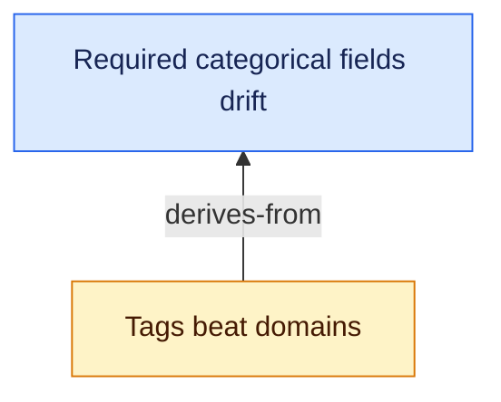

# Verbs

`ORBIT_TASK_ID` and `ORBIT_RUN_ID` fill absent provenance flags on `new`,
`promote`, `cite` and `handoff`. A nonempty `ORBIT_RUN_ID` requires explicit
`--by` for new authored words (`by_required`) and refuses `sharpen --confirm`
(`human_only`). `NEBULA_READ_ONLY=1` refuses every write (`read_only`).

Every corpus verb below takes `--root <DIR>` and `--json`, and those flags may
appear anywhere on the line — before the verb, after it, or after the free
text of `capture`, `note` and `near`. Every verb that writes also takes
`--no-commit`, after the verb; a read-only verb such as `show`, `list` or
`trace` refuses it there as an unknown argument. The older spelling before the
verb is deprecated: before a verb that writes it still skips the commit and
warns on stderr, and before any other verb it is refused (`usage`, exit 2).
Under `--json`, each emits
one JSON value on stdout. Two commands are the exceptions: `completions`
always emits a shell script, and refuses `--json` and `--root` rather than
ignore them (exit 2; `$NEBULA_ROOT` is not read), and `triage`, which takes its decisions from a
person one key at a time, refuses `--json` (`Interactive`) and names the
scriptable verbs instead. Ids are slugs of the title
(`"Tags beat domains"` → `tags-beat-domains`); inbox ids are four hex chars. A
slug over 60 characters is cut at the last `-` at or before the limit, never
mid-word. `promote` without `--title` or `--id` keeps the captured sentence
as the title but, for a capture over five words, mints the id from its first
five words after dropping stop-words (`gravity might be a scarcity gradient
in some shared resource` → `gravity-scarcity-gradient-shared-resource`); if
that id belongs to a different idea it adds one more such word at a time, then
falls back to the full slug. A node already titled with the same text is
refused with `NodeExists` naming it, never duplicated, as is a capture whose
every candidate is taken.
`promote` and `new` take `--id <SLUG>` to choose the id explicitly
instead — useful for a long title, since ids are frozen by invariant once
written. An explicit id follows the same slug rules (lowercase words joined
by single dashes, 60 characters or fewer) and is refused, as a typed error,
if it breaks those rules or collides with an existing node.
The `--json` excerpts below are real output from a three-node fixture corpus.

Every field a `--json` payload documents is present in it: an absent value is
`null` and an empty list `[]`, never a missing key, so one kind of record has
one key set whichever verb returned it. A node is always
`{id, title, title_by, status, created, updated, kill, kill_by, tags, edges,
references, closed, origin}`, and every author label is stated, `"human"`
where nobody passed `--by`, from a write verb exactly as from `show`. A list
that a limit cut says so: see [capped lists](#capped-lists).

## stdout and stderr

stdout carries the result and nothing else: records, ids, the report. So
`neb list | wc -l` counts nodes, `grep` and `cut` see only records, and
`E=$(neb capture -q …)` holds the entry id alone. Everything about the
result goes to stderr, one line each: counts (`3 of 4 nodes`), what
`--limit` or `--depth` left out, the line saying a query found nothing,
hints, and `committed <hash>`. Under `--json` the line saying nothing
matched and the line saying a bound cut the result are still written to
stderr; counts, hints and `committed` are not.

A list is a table. On a terminal it has one header row, then one line per
record, never wrapped or cut; columns are two spaces apart, a count is
right-aligned under its header, and an empty cell reads `-`. Piped or
redirected, the same records are one tab-separated line each, with no
header and no colour, and every column is there (`-` when empty), so `cut
-f3` is always the same field:

| verb | columns |
|---|---|
| `list` | `STATUS ID TAGS TITLE`, the tags comma-joined in one cell |
| `inbox` | `ID AT TEXT` |
| `near` | `BAND STATUS ID TITLE LINKED` |
| `tag list` | `TAG COUNT` |
| `review --short` | `ID WHY` |
| `log` | `HASH DATE MESSAGE` |

```
// neb list --tag design        (on a terminal)
STATUS      ID                        TAGS           TITLE
abandoned   a-single-global-taxonomy  design         A single global taxonomy
hypothesis  tags-beat-domains         design,corpus  Tags beat domains

// neb list --tag design | cat
abandoned	a-single-global-taxonomy	design	A single global taxonomy
hypothesis	tags-beat-domains	design,corpus	Tags beat domains
```

An empty list prints nothing on stdout, header included. `show`, `trace`,
`impact`, `check` and `review` are reports, not lists, and keep their own
layouts.

Colour is decided once, per stream: text is coloured only for a terminal,
never when that stream is piped or redirected, when `TERM=dumb`, or when
`NO_COLOR` is set to a non-empty value. `CLICOLOR_FORCE` never colours a
pipe. Each colour stands for a role (a live seed, an owed hypothesis, a dead
node, an error) and is never the only thing saying so. `--help` is never
coloured and never re-wrapped to the terminal's width.

## Refusals under `--json`

Under `--json` a refusal is data too: one JSON object on one line, the last
line on **stderr**. Stdout stays the payload's alone. Match on `code`, never
on `error`:

```json
// neb show nope --json      (stderr; stdout is empty; exit 1)
{"code":"no_such_node","error":"no node `nope`","hint":"List what exists with:  neb list"}
```

| field | type | what it is |
|---|---|---|
| `error` | string | What is wrong, in the words the text output uses before its hint. |
| `code` | string | The refusal's stable `snake_case` name. For a core refusal it is the `nebula-core` variant's name in `snake_case`: `no_such_node`, `cycle`, `self_loop`, `needs_kill`, `refuted_needs_why`, `refuted_cannot_reopen`, `seed_with_kill`, `unknown_reference_kind`, `unresolved_uri`, `absolute_uri`, `schema_mismatch`, `missing_config`, `corpus_ignored`, `git`, `git_timed_out`, `locked`, `edit_conflict`, `input_too_large`, `io_at` (an I/O failure, naming the path), `io_stdin` (standard input could not be read), `stdin_not_utf8`, `empty_capture` (an empty `capture`), `empty_note`, `reason_on_open_status`, `no_kill_to_confirm`, `uri_required`, `invalid_author_label`, `invalid_at`, `not_a_status`, `not_an_edge_type`, `malformed_frontmatter`, `unreadable_nodes` (a strict graph load found unreadable node files), `yaml` (YAML could not be parsed or rendered), `invalid_read_only_environment` (the read-only switch is neither empty nor `1`), `invalid_origin_environment` (non-UTF-8 Orbit provenance), `current_schema_unreadable` (migration refuses an unreadable current-schema node), `inbox_entry_missing`, `inbox_entry_changed`, `inbox_entry_foreign`, `inbox_ids_exhausted`, `nodes_symlink`, `inbox_symlink`, `not_regular_file` (a node file, `config.yaml`, `.lock` or another corpus file that is a symlink, a FIFO, a device or a directory), `home_unset`, `home_not_unicode`, `empty_root_setting`, `relative_root_setting`, `dirty_tree`, `not_a_v1_status`, `not_a_v1_edge_type`, `migrated_node_unreadable`, `malformed_history`, `no_free_keep_name`, `temp_cleanup_failed`, `no_free_temp_name`, and the rest in [invariants.md](invariants.md#what-each-refusal-means-and-what-to-do). The CLI adds its own: `usage` (arguments that parse but ask for nothing, such as `graph` with no format, `near` with no text, or `--no-commit` before a verb that never commits), `editor_not_configured` (neither editor variable names an editor), `editor_invalid_command` (empty command or unmatched quotes), `editor_start` (the editor could not start), `editor_unsuccessful` (the editor exited unsuccessfully), `report_in_corpus` (`review --out` resolves inside the corpus; choose an external file), `triage_key` (a key `triage` does not know), `triage_title_lost` (input ended while a `triage` title was waiting to be used), `stdout` (writing standard output failed; a broken pipe exits quietly instead) and `json` (JSON could not be parsed or rendered, with context). Core also reports `notes_changed` when an edit removes, reorders or changes an existing Notes section. |
| `hint` | string or `null` | What to do about it, as the text output words it: often a command to run, such as `neb sharpen <id> --kill "..."`. `null` when the CLI has nothing to add. |

Key order is not significant. A new refusal arrives with its own `code` and
the same three fields; new fields may be added, and existing ones will not
change meaning. `SchemaMismatch` covers both directions: the hint says
whether to `neb migrate` (the corpus is older) or upgrade `neb` (newer).

Exit codes, with or without `--json`:

| code | means | stdout | stderr under `--json` |
|---|---|---|---|
| 0 | success | the payload | empty, bar a `warning:` or `note:` line (from `init`, `capture`, or a commit that could not happen), or the line saying a query found nothing or a bound cut the result |
| 1 | a refusal | empty, **except** when the write landed and its commit was refused (`CorpusIgnored`, `Git`, `GitTimedOut`): then it holds the write's payload | the envelope |
| 1 | `check` found an `error`-level finding | the report | empty |
| 2 | a usage error `neb` raised: an argument no corpus could accept, whatever it holds (`usage`, `interactive`, `self_loop`, `parent_and_reopens`, `empty_kill`, `refuted_needs_why`, `absolute_uri`, `unusable_title`, `unknown_reference_kind`, `invalid_observatory_id`, `invalid_id`, `empty_root`, `root_and_path_differ`, `empty_capture`, `empty_note`, `reason_on_open_status`, `uri_required`, `invalid_at`, `invalid_author_label`, `not_a_status`, `not_an_edge_type`, and `relative_observatory_root` for a path given on the command line); nothing was written | empty | the envelope |
| 2 | clap rejected the command line: unknown flag, missing argument, bad value | empty | clap's prose, **not** JSON: it is raised before `neb` knows `--json` was asked for |

A refusal of a line read by `triage` from piped input exits 1 whatever its
code: the command line was fine. Without `--json`, every refusal prints
`error:`, the message, and the hint after a blank line.

## Corpus

| verb | does | flags |
|---|---|---|
| `neb init [PATH]` | create an empty corpus without changing the machine default | `--set-root`, `--force` (requires `--set-root`) |
| `neb check` | run the rules in [invariants.md](invariants.md); exit non-zero on any error | — |
| `neb migrate` | v1 → v2 in place; idempotent; refuses on a dirty git tree | — |
| `neb config observatory-root [DIR]` | read or set where the Observatory checkout is on this machine | `--drop-legacy` |
| `neb config commit [on\|off]` | read or set whether each write is committed to the corpus's git repository | — |

`config commit` rewrites `config.yaml` whole when the setting changes; `init`,
`migrate`, and `capture` when it initializes a corpus can write it too. The
file stays machine-written and is never hand-edited.

`config observatory-root DIR` writes this machine's
`~/.config/nebula/observatory-root` and nothing in the corpus, so it commits
nothing; `DIR` must be absolute. Without `DIR` it prints the effective root and
which setting supplied it: `$OBSERVATORY_ROOT`, else this machine's setting,
else the legacy `observatory_root` key an older `neb` wrote into `config.yaml`,
else nothing. The legacy key is deprecated: a verb that resolves a record
through it (`show`, `cite --kind observatory`, `handoff`) warns on stderr,
naming it and `neb config observatory-root <DIR>`. `legacy` names that key whenever the file still carries it, in
force or not. `--drop-legacy` removes it from `config.yaml` (a corpus write,
committed as `neb config observatory-root` when `commit` is on); run it once
every machine that shares the corpus has its own setting. It says on stderr,
in every mode, what it did: `removed the legacy observatory_root (<path>) from
<root>/config.yaml`, or, when there is no key,
`no legacy observatory_root key in <root>/config.yaml; nothing removed`, and
then the file is not rewritten and nothing is committed.

```json
// neb init /Users/you/.nebula --json
{ "root": "/Users/you/.nebula" }
```

`--root` and `PATH` name the same thing, so `neb --root A init B` with two
different directories is refused before either is created
(`root_and_path_differ`, exit 2); the same directory given both ways is fine.

Plain `init` never writes `~/.config/nebula/root`. For a primary non-default
corpus, pass `--set-root`; it refuses to replace a setting that names another
corpus unless `--force` is also explicit. Scratch corpora use `--root` and
never `--set-root`. The setting must hold one absolute path: an empty or
relative one is refused by every command that reads it
(`empty_root_setting`, `relative_root_setting`), and `--set-root` replaces
such a setting without `--force`, since it names no corpus.

```json
// neb config observatory-root --json     (source: env | machine | config | unset)
{ "root": "/Users/you/workspace/observatory", "source": "machine", "legacy": null }
```

```json
// neb config commit --json
{ "enabled": true }
```

With `commit` on (off by default) and the corpus root inside a git work
tree, a changed corpus write can end with one commit of `nodes/`, `inbox/`,
`config.yaml` and the generated `.gitignore`. A commit is named
`neb <verb> <ids>` and prints `committed <hash>` on
stderr in text mode (nothing extra in `--json`). It never pushes and never touches a
path outside the corpus root. The commit names those paths, so anything else
staged in the repository — before the verb or while it runs — is left staged
and out of it. With `commit` on and no git repository at or above the root,
the verb succeeds and says `note: not committed: <root> is not inside a git
work tree` on stderr, in every mode. When git fails — a hook, a repository it
cannot read — the verb exits non-zero with a `git` refusal **after** its
write has landed: the write is never rolled back because of git; report it
rather than retry the write. `--no-commit` skips the commit for one
invocation.

`check` writes `corpus: <root>` and its findings on stdout, and its tally on stderr:
`N nodes, E errors, W warnings, U unreadable files` (each noun is singular
when its count is 1). `N` counts readable nodes; `E` includes unreadable files
as well as error-level findings. Any unreadable file or error finding means
exit 1. Under `--json`, stdout is the report below and there is no tally on
stderr. `unreadable` contains `{path, code, message}` for each unreadable
node file; the remaining nodes are still checked.

```json
// neb check --json          (findings[] carries {rule, level, node, message})
{ "root": "/Users/you/.nebula", "unreadable": [], "findings": [], "nodes": 3 }
```

## Inbox

| verb | does | flags |
|---|---|---|
| `neb capture <TEXT\|->...` | append a thought as one inbox line; prints the entry id, then the three nearest nodes; works on a corpus that does not exist yet, and then says so on stderr (`note: created a new corpus at <absolute path>`); a thought already waiting in the inbox is still captured, and stderr says `note: same as <id>, still waiting` | `--quiet`/`-q` (before or after the text): the entry id alone |
| `neb inbox` | live entries (not promoted, not dropped), oldest first | `--limit <N>` |
| `neb promote <ENTRY>` | inbox entry → seed node; without `--parent`, prints the three nearest nodes and proceeds as a root | `--title`, `--body <TEXT\|->`, `--parent <ID>`×, `--tag <TAG>`×, `--id <SLUG>`, `--by <LABEL>`, `--task`, `--run`, `--quiet`/`-q`: the node id alone |
| `neb drop <ENTRY>` | strike an entry through; never deleted | — |
| `neb triage` | walk the waiting entries oldest first and decide each with one key, through `promote` and `drop` | `--by <LABEL>` |

```json
// neb inbox --json
[ { "id": "a6e8", "at": "2026-09-12T18:16:42+02:00", "text": "nebula review as a weekly orbit routine" } ]
```

`at` is RFC 3339 to the second, with the offset the capture was stamped at,
and `Z` when the local offset could not be read. An entry captured before
0.2.0 has a stamp with no offset (`2026-09-12T18:16` in the inbox file); it
lists as local time with the offset this machine has for that instant, and
its line is never rewritten.

`triage` is for a human at a terminal. It snapshots the inbox, then shows
each entry in turn, oldest capture first, with its position, stamp and age
and its `near` candidates numbered from 1. One line decides it:

| key | does | the same as |
|---|---|---|
| `p` | promote as a root | `neb promote <entry>` |
| `1`–`3` | promote under that numbered candidate | `neb promote <entry> --parent <id>` |
| `t <title>`, or `t` then the title on the next line | title the promotion that follows; a blank title goes back to the captured text | `--title` |
| `d` | drop | `neb drop <entry>` |
| `s` | leave it waiting and move on | — |
| `q` | stop; everything undecided stays waiting | — |
| `?` | list the keys | — |

Nothing is linked unless a number is chosen. Each promote or drop is the
single verb, with its refusals and `--by`, and with `commit` on it makes the
single verb's commit — `neb promote <entry> <id>`, `neb drop <entry>` — one
per decision; `--no-commit` waives them for the session. The session ends
with `promoted N, dropped N, skipped N; N still waiting`. On a terminal a
refused key or decision is reported and the same entry is asked about again.
With standard input piped, keys are read one per line with no prompt, and the
first refusal ends the session with exit 1, because the lines after it were
written for an entry that did not move; end of input stops as `q` does, except
while a title is waiting to be used (after `t`, before the `p` or number it was
for), which is a refusal, exit 1, naming the title and the `neb promote`
that would use it. An
agent does not use `triage`: run `inbox`, `near`, `promote` and `drop` with
`--json`, which is what it is made of.

`capture`, `note` and `near` take remaining words as the thought, so a flag
after the text is still a flag: `neb capture "an idea" --quiet` quiets and
stores `an idea`; `neb note <id> "a thought" --no-commit` skips the commit
and stores `a thought`. A thought that itself contains a token starting with
`-` is one quoted argument, or sits after `--`
(`neb capture -- --quiet is the idea`).

A lone `-` reads the thought from standard input, up to 64 KiB (65536
bytes); more is refused as `input_too_large` before the corpus is opened for
writing, so nothing is captured. Text over several lines,
piped or quoted, is joined onto one line: each line break becomes a single
space and blank lines vanish, so `printf 'a\nb\n' | neb capture -` stores
`a b`. Only whitespace-only text is refused (`nothing to capture`, code
`empty_capture`), before a missing corpus is created for it.

`capture` prints the entry id on its own line, then — when any node shares a
word with the text — a `near:` block of up to three lines, `<band> <status>
<id> <title>`, best first (bands under [`near`](#query)). `promote` prints `<id> <path>` and, when no
`--parent` was given, the same block for the title plus captured text. Both
are the [`near`](#query) query run for you: a suggestion for the triage
step, never an edge. `promote` writes the node as a root whatever it lists,
and with `--parent` lists nothing, since that decision is made. `--quiet`
prints the id alone; `promote --json` carries the path. No block at all means nothing in the corpus
shares a word with it — promote as a root or drop. The suggestions are
read after the capture is written and committed, with the write lock
released. They are a side channel: a node file that will not parse costs
the suggestions — `warning: suggestions unavailable: …` on stderr, naming the
file — and never the capture, which still exits 0 with its id (or, under
`--json`, its entry with `near: []`) on stdout. `--quiet` does not read
`nodes/` at all.

The duplicate check compares the text with every entry still waiting, after
folding case and collapsing whitespace, and names the earliest match. Settled
entries do not count, and a reworded thought is not caught. The notice
is on stderr in both modes, so the id, or the `--json` payload, is unchanged.

`promote` and `drop` on an entry that was already settled say how it was,
from its struck-through line: `` `<id>` was already promoted to `<node>` ``
or `` `<id>` was already dropped `` (`InboxEntrySettled`). An id nothing
recorded is still `no open inbox entry` (`NoSuchInboxEntry`).

`promote --body <TEXT>` keeps the captured line as the first paragraph and
appends `TEXT` after it. With `--body -`, the appended prose is read from
standard input, up to 1 MiB (1048576 bytes); more is refused as
`input_too_large` before anything is written.

```json
// neb capture --json "domains drift when a field is required"
{
  "entry": { "id": "f1ca", "at": "2026-09-21T01:57:08+02:00", "text": "domains drift when a field is required" },
  "near": [
    { "id": "required-categorical-fields-drift", "title": "Required categorical fields drift",
      "status": "seed", "tags": ["design"], "score": 0.555, "band": "strong", "linked": null },
    { "id": "tags-beat-domains", "title": "Tags beat domains",
      "status": "hypothesis", "tags": ["design", "corpus"], "score": 0.177, "band": "some", "linked": null }
  ]
}

// neb promote --json f1ca --title "Required fields drift domains"
{
  "doc": {
    "node": { "id": "required-fields-drift-domains", "title": "Required fields drift domains",
              "title_by": "human", "status": "seed", "created": "2026-09-21", "updated": "2026-09-21",
              "kill": null, "kill_by": null, "tags": [], "edges": [], "references": [],
              "closed": null, "origin": null },
    "body": "domains drift when a field is required"
  },
  "path": "/Users/you/.nebula/nodes/required-fields-drift-domains.md",
  "near": [
    { "id": "required-categorical-fields-drift", "title": "Required categorical fields drift",
      "status": "seed", "tags": ["design"], "score": 0.619, "band": "strong", "linked": null },
    { "id": "tags-beat-domains", "title": "Tags beat domains",
      "status": "hypothesis", "tags": ["design", "corpus"], "score": 0.114, "band": "some", "linked": null }
  ]
}
```

```json
// neb drop 5572 --json
{ "id": "5572", "at": "2026-09-21T02:56:31+02:00", "text": "duplicate thought" }
```

`near` is `[]` in both when it would be empty, so `--quiet`, a `--parent`,
and a thought unlike anything in the corpus all read the same way:
`"near": []`.

## Nodes

| verb | does | flags |
|---|---|---|
| `neb new <TITLE>` | create a node directly | `--body <TEXT\|->`, `--parent <ID>`×, `--reopens <ID>`, `--contradicts <ID>`×, `--kill`, `--tag <TAG>`×, `--id <SLUG>`, `--by <LABEL>`, `--task`, `--run` |
| `neb edit <NODE>` | open the body, without frontmatter, in `$VISUAL` or `$EDITOR` | `--by <LABEL>` (required under an Orbit run) |
| `neb sharpen <NODE> --kill <KILL>` | seed → hypothesis by naming the falsifier | `--by <LABEL>`, or `--confirm` instead of `--kill` |
| `neb status <NODE> <STATUS>` | `seed`, `hypothesis`, `refuted`, `abandoned`, with guards | `--why` (required for refuted, optional for abandoned) |
| `neb link <FROM> <KIND> <TO>` | `derives-from`, `refines`, `generalizes`, `reopens`, `contradicts` | `--by <LABEL>` |
| `neb tag <NODE>` | edit tags; normalised to lowercase kebab-case | `--add <TAG>`×, `--remove <TAG>`× |
| `neb tag list` | every tag with its node count | — |
| `neb note [--by <LABEL>] <NODE> <TEXT>...` | append a dated paragraph of reasoning to the body | `--by <LABEL>` (before or after the text) |

`tag` notes on stderr, in every output mode, each tag that was not on the
node to `--remove` (`` `absent` is not a tag of <id>; nothing to remove ``) or
was already on it to `--add` (`` `physics` is already a tag of <id>; nothing to
add ``). When that leaves the tags as they were, the node is not written:
`updated` stays, nothing is committed, and stderr ends
`no change; <id> not written`. The exit code is 0 either way.

`new`, `promote` and `tag --add` print `note: tag physic is close to physics
(2 nodes)` on stderr, in every output mode, when a tag they introduce to the
corpus differs from one in use only by case or a trailing `s`. The write has
already succeeded. Reuse the existing tag unless the difference is deliberate:
`neb tag <NODE> --remove physic --add physics`.

`new --body <TEXT>` sets the prose at creation; `--body -` reads it from
standard input, up to 1 MiB (1048576 bytes), refusing more as
`input_too_large` before anything is written. `new --kill "..."` starts the node as a hypothesis; without
it, a seed.
`new --reopens <ID>` revives a refuted node as a new one with a single
`reopens` edge; that edge is genealogy, so naming the same node as `--parent`
too is refused. `new --contradicts <ID>` writes the edge on both nodes, as
`link` does. Every edge is checked before anything is written: a missing
node, the same edge twice, or a genealogy loop refuses the whole `new`.
`sharpen --kill` refuses to replace a kill condition already present on an open
node and prints the existing falsifier. A changed falsifier is a changed idea:
create a new node and relate it to the old one instead of overwriting the
record. On a refuted node, the stricter final-verdict refusal still applies.
`sharpen --confirm` takes no text: it adopts the kill condition already on the
node as the human's own, changing nothing else and appending nothing.
`status <id> seed` refuses a node that names a kill condition
(`SeedWithKill`), because the kill would stay and leave a seed carrying one;
reopen it with `status <id> hypothesis` instead, including from `abandoned`.
`contradicts` is written on both nodes. `link` prints `<from> <kind> <to>`.
`note` creates a `## Notes` section at the end of the body if needed, then
appends `- YYYY-MM-DD: <text>`. Repeated notes accumulate in order; earlier
body text, status, edges and tags are left as they are. `updated` is bumped.
`edit` writes only the prose body to a temporary file, preferring `$VISUAL`
over `$EDITOR`, then saves the result after the editor exits successfully.
No lock is held while the editor is open, so captures and other writes go
on meanwhile; the lock is taken only to save. If the body changed in the
meantime (a `note`, another `edit`), the save is refused as `edit_conflict`
rather than erase that change; a change to the frontmatter alone (a `tag`, a
`status`) is kept and the edit lands on top of it. Whenever a save is refused
after the editor exits — `edit_conflict`, `notes_changed`, `locked`, a failed
write — the text you typed is kept first, as a new owner-only
`<id>-<UTC stamp>.md` under `$XDG_STATE_HOME/nebula/edits/` (default
`~/.local/state/nebula/edits/`), outside the corpus, and the refusal (and its
`--json` `error`) ends `your edited text is kept at <path>`. Look at the node
with `neb show <id>`, then `neb edit <id>` again and carry the text over.
Frontmatter is never exposed. If the node already has a `## Notes` section,
removing, moving or changing it is refused; append reasoning with `note`
instead. A body can hold more than one such section, because `note` opens a
fresh one rather than reach back into a section other prose has closed, and
every one of them is protected. A body left as it was (outer whitespace aside)
is not written: `updated` stays, nothing is committed, stderr says
`no change; <id> not written`, and `--json` still prints the node. `edit`
accepts `--by` and requires it under an Orbit run, although the body has no
per-field author in the current schema. With neither environment variable set,
`edit` refuses and names both variables.
Unknown nodes are refused (`NoSuchNode`). `--json` is the same `NodeView` as
`show --json`: `notes` is a list of `{at, text, by}`, oldest first, and `[]`
when there are none.

The write verbs return the core value they changed. `new` returns `{doc,
path, near}`, `near` always `[]`; `sharpen` (including `--confirm`) and `tag` return a `Doc`; `status`
returns `{doc, from}`; and `link` returns an array because `contradicts`
changes both nodes.

```json
// neb new "Tags beat domains" --tag design --json
{
  "doc": {
    "node": { "id": "tags-beat-domains", "title": "Tags beat domains", "title_by": "human",
              "status": "seed", "created": "2026-09-21", "updated": "2026-09-21",
              "kill": null, "kill_by": null, "tags": ["design"], "edges": [], "references": [],
              "closed": null, "origin": null },
    "body": ""
  },
  "path": "/Users/you/.nebula/nodes/tags-beat-domains.md",
  "near": []
}
```

```json
// neb sharpen tags-beat-domains --kill "a corpus of 50 nodes needs a query tags cannot answer" --json
{
  "node": { "id": "tags-beat-domains", "title": "Tags beat domains", "title_by": "human",
            "status": "hypothesis", "created": "2026-09-21", "updated": "2026-09-21",
            "kill": "a corpus of 50 nodes needs a query tags cannot answer", "kill_by": "human",
            "tags": ["design"], "edges": [], "references": [], "closed": null, "origin": null },
  "body": ""
}
```

```json
// neb status a-single-taxonomy abandoned --why "tags preserve the useful cross-cuts" --json
{
  "doc": {
    "node": { "id": "a-single-taxonomy", "title": "A single taxonomy", "title_by": "human",
              "status": "abandoned", "created": "2026-09-21", "updated": "2026-09-21",
              "kill": null, "kill_by": null, "tags": [], "edges": [], "references": [],
              "closed": { "why": "tags preserve the useful cross-cuts", "at": "2026-09-21" },
              "origin": null },
    "body": ""
  },
  "from": "seed"
}
```

```json
// neb link tags-beat-domains contradicts a-single-taxonomy --json
[
  { "node": { "id": "tags-beat-domains", "title": "Tags beat domains", "title_by": "human",
              "status": "hypothesis", "created": "2026-09-21", "updated": "2026-09-21",
              "kill": "a corpus of 50 nodes needs a query tags cannot answer", "kill_by": "human",
              "tags": ["design"],
              "edges": [{ "type": "contradicts", "to": "a-single-taxonomy", "by": "human" }],
              "references": [], "closed": null, "origin": null }, "body": "" },
  { "node": { "id": "a-single-taxonomy", "title": "A single taxonomy", "title_by": "human",
              "status": "seed", "created": "2026-09-21", "updated": "2026-09-21",
              "kill": null, "kill_by": null, "tags": [],
              "edges": [{ "type": "contradicts", "to": "tags-beat-domains", "by": "human" }],
              "references": [], "closed": null, "origin": null }, "body": "" }
]
```

```json
// neb tag tags-beat-domains --add corpus --json
{
  "node": { "id": "tags-beat-domains", "title": "Tags beat domains", "title_by": "human",
            "status": "hypothesis", "created": "2026-09-21", "updated": "2026-09-21",
            "kill": "a corpus of 50 nodes needs a query tags cannot answer", "kill_by": "human",
            "tags": ["design", "corpus"],
            "edges": [{ "type": "contradicts", "to": "a-single-taxonomy", "by": "human" }],
            "references": [], "closed": null, "origin": null },
  "body": ""
}
```

```json
// neb --json note tags-beat-domains "folksonomy is the argument, not a taxonomy with extra steps"
{
  "node": { "id": "tags-beat-domains", "title": "Tags beat domains", "status": "hypothesis", … },
  "body": "tags beat domains because a category you must pick is a decision you skip\n\n## Notes\n\n- 2026-09-21: folksonomy is the argument, not a taxonomy with extra steps",
  "notes": [
    { "at": "2026-09-21", "text": "folksonomy is the argument, not a taxonomy with extra steps",
      "by": "human" }
  ]
}
```

```json
// neb tag list --json
[ { "tag": "corpus", "count": 1 }, { "tag": "design", "count": 3 } ]
```

## References

| verb | does | flags |
|---|---|---|
| `neb cite <NODE> [--uri <URI>]` | attach context | `--kind` (paper, study, article, note, discussion, book, dataset, thread, observatory, other), `--title`, `--note`, `--by <LABEL>`, `--task`, `--run` |
| `neb handoff <NODE> <RECORD>` | hand the node off to an Observatory record: cite it and close the node, in one write | `--note`, `--by <LABEL>`, `--task`, `--run` |

`--kind` is lowercased before it is checked (`--kind Paper` stores `paper`);
anything still outside the list is refused. `--uri` may be omitted only with
`--kind discussion`; every other kind requires
it. A local URI is resolved relative to `nodes/` and refused if it does not
exist; an absolute path or `file:` URI is refused even when it does, because
it resolves on this machine only. Always pass `--note`: it is the only field
that matters in a year.

`cite --json` returns the changed `doc`, the newly allocated reference id, and
`observatory`, which is `null` for every kind but `observatory` (see below):

```json
// neb cite tags-beat-domains --kind article --uri https://example.org/folksonomy --note "the drift argument" --json
{
  "doc": {
    "node": {
      "id": "tags-beat-domains", "title": "Tags beat domains", "title_by": "human",
      "status": "hypothesis", "created": "2026-09-21", "updated": "2026-09-21",
      "kill": "a corpus of 50 nodes needs a query tags cannot answer", "kill_by": "human",
      "tags": ["design", "corpus"],
      "edges": [{ "type": "contradicts", "to": "a-single-taxonomy", "by": "human" }],
      "references": [
        { "id": "r1", "kind": "article", "uri": "https://example.org/folksonomy",
          "title": null, "note": "the drift argument", "added": "2026-09-21",
          "by": "human", "origin": null }
      ],
      "closed": null, "origin": null
    },
    "body": ""
  },
  "reference": "r1",
  "observatory": null
}
```

### Observatory records

`--kind observatory` links a node to an Observatory record, and its `--uri` is
the bare record id — `Q<nnn>`, `H<nnn>`, `T<nnn>` or `R<nnn>` — not a path.
That is what makes the citation portable: nothing machine-specific reaches the
corpus. Case is normalised up (`q<nnn>` stores `Q<nnn>`), and anything that is
not one of `Q`,
`H`, `T`, `R` followed by digits is a typed refusal at `cite`.

Where the record is comes from the machine, not the reference or the corpus:
`$OBSERVATORY_ROOT`, else this machine's setting (`neb config observatory-root
<DIR>`), else the legacy `observatory_root` key in `config.yaml`. The id is
matched by prefix inside the directory its
letter names — `questions/`, `hypotheses/`, `theories/`, `research/` — so
`Q<nnn>` finds `questions/Q<nnn>-<slug>.md` and `R<nnn>` finds the
`research/R<nnn>-<slug>/` directory.

`check` warns, and never errors, when the root is unset or the id does not
resolve: the citation is still true, and the machine is merely missing or
behind the checkout. `show` prints the resolved path under the reference, and
`show --json` carries an `observatory` array of
`{reference, record, path}` (`path` is `null` when it does not resolve).
`cite --kind observatory` prints the path it resolved to, and `cite --json`
carries the same `{reference, record, path}` for the new reference as
`observatory`, `path` `null` with no root or no match.

```json
// neb cite proper-time-is-a-count --kind observatory --uri Q<nnn> --note "the question this became"
// then: neb show proper-time-is-a-count --json
{
  "node": {
    …,
    "references": [
      { "id": "r1", "kind": "observatory", "uri": "Q<nnn>", "title": null,
        "note": "the question this became", "added": "2026-09-21", "by": "human",
        "origin": null }
    ],
    …
  },
  "observatory": [
    { "reference": "r1", "record": "Q<nnn>",
      "path": "/Users/you/workspace/observatory/questions/Q<nnn>-<slug>.md" }
  ]
}
```

### Hand-off

`neb handoff <NODE> <RECORD> --note "why"` is the one-step form of "this idea
became Observatory record `RECORD`". In one write it adds an `observatory`
reference to the record, with the note, and moves the node to `abandoned`
with `closed.why: handed off to <RECORD>`. The record id follows the same
rules as `cite --kind observatory`: a bare id, case normalised up.

It refuses, writing nothing: an unknown node (`NoSuchNode`); a node already
refuted or abandoned (`AlreadyClosed`), including one handed off before; a
record id of the wrong shape (`InvalidObservatoryId`); and, when this machine
has an observatory root, a record that does not resolve under it
(`UnresolvedObservatoryRecord`). With no root set, the id is accepted and the
verb prints the same `No observatory root set` line `cite` does, on stderr.
The record's path, when it resolves, is part of the result on stdout; a
missing `--note` is nudged on stderr.

```
// neb handoff scarcity-wake H<nnn> --note "the hypothesis this became"
scarcity-wake seed -> abandoned, handed off to H<nnn> (r1)
/Users/you/workspace/observatory/hypotheses/H<nnn>-<slug>.md
```

`--json` returns the node as written, the new reference's id, the record as
stored, the status it left, and where the record is, as `observatory`
(`{reference, record, path}`, `path` `null` with no root):

```json
// neb handoff scarcity-wake H<nnn> --note "the hypothesis this became" --json
{
  "doc": {
    "node": {
      "id": "scarcity-wake", "title": "Scarcity wake", "title_by": "human",
      "status": "abandoned", "created": "2026-09-26", "updated": "2026-09-26",
      "kill": null, "kill_by": null, "tags": [], "edges": [],
      "references": [
        { "id": "r1", "kind": "observatory", "uri": "H<nnn>", "title": null,
          "note": "the hypothesis this became", "added": "2026-09-26", "by": "human",
          "origin": null }
      ],
      "closed": { "why": "handed off to H<nnn>", "at": "2026-09-26" },
      "origin": null
    },
    "body": ""
  },
  "reference": "r1",
  "record": "H<nnn>",
  "from": "seed",
  "observatory": { "reference": "r1", "record": "H<nnn>",
                   "path": "/Users/you/workspace/observatory/hypotheses/H<nnn>-<slug>.md" }
}
```

A node reads as handed off when it is `abandoned`, its `closed.why` is
exactly `handed off to <RECORD>`, and it carries an `observatory` reference
to that record, so the two-verb form reads the same. `show` then prints the
record's location under its `closed:` line, `trace` appends
`handed off to <RECORD>` to its line, and both `--json` forms carry
`"handed_off_to": "<RECORD>"`, and `null` for every other node.

## Authorship

`--by <LABEL>` records who wrote the text a verb authors. The label is free
text — a session id, a crew name — and defaults to `human`, so an
unattributed write reads as the human's own. It is stored per field rather
than per node: `title_by`, `kill_by`, `by` on each edge and each reference,
and, for a note, inline in the line it writes
(`- YYYY-MM-DD (agent:crew-alpha): text`; the human's line names nobody). The
human is stored by omission, so files written before this existed are already
correct and `neb migrate` has nothing to do; `show --json` and `list --json`
state the default outright. A label cannot contain parentheses, a newline or
`: `, since a note line has to parse back.

`--by` is not `--task`/`--run`: those say which Orbit run produced a write,
not who wrote the words. `check` enforces nothing about authorship.

## Query

| verb | does | flags |
|---|---|---|
| `neb show <NODE>` | one node in full, plus its body, currently or at a historical revision | `--at <HASH\|YYYY-MM-DD>` |
| `neb log <NODE>` | commits that changed the node, newest first | — |
| `neb list` | every node | `--status <S>`, `--tag <TAG>`× (every tag must match), `--limit <N>` |
| `neb near <QUERY>...` | the existing nodes closest to free text, or to a node (left out of its own answer), best first, each banded `strong`/`some`/`weak`; for a node, marks neighbours already linked to it | `--limit <K>`/`-k` (default 3); flags may follow the query |
| `neb trace <NODE>` | ancestry as a tree on a terminal (one tab-separated line per node when piped), each line naming its edge kind(s) | `--down` for descendants, `--depth <N>` |
| `neb impact <NODE>` | descendants plus `contradicts` neighbours | — |
| `neb graph` | the whole corpus as `{nodes, edges}` or a Mermaid diagram | `--json`, or `--mermaid [--from <ID>]`; without a format, a `usage` refusal naming both, exit 2 |

```json
// neb show tags-beat-domains --json
{
  "node": {
    "id": "tags-beat-domains",
    "title": "Tags beat domains",
    "title_by": "human",
    "status": "hypothesis",
    "created": "2026-09-12",
    "updated": "2026-09-12",
    "kill": "a corpus of 50+ nodes needs a cross-cutting query that tags cannot answer",
    "kill_by": "human",
    "tags": ["design", "corpus"],
    "edges": [
      { "type": "derives-from", "to": "required-categorical-fields-drift", "by": "human" },
      { "type": "contradicts", "to": "a-single-global-taxonomy", "by": "human" }
    ],
    "references": [
      { "id": "r1", "kind": "article", "uri": "https://example.org/folksonomy",
        "title": "Folksonomies", "note": "the drift argument, made for web tagging",
        "added": "2026-09-12", "by": "human", "origin": null }
    ],
    "closed": null,
    "origin": null
  },
  "body": "tags beat domains because a category you must pick is a decision you skip",
  "notes": [],
  "observatory": [],
  "handed_off_to": null
}
```

In text, `show` opens with a header: the status and id; the title, followed
by `(<label>)` when an agent wrote it; `tags: a, b` when there are any; and
`created: <date>  updated: <date>`. The kill condition, each edge and each
reference likewise end in `(<label>)` when their author is not `human`.

```
// neb show tags-beat-domains
hypothesis tags-beat-domains
Tags beat domains
tags: design, corpus
created: 2026-09-12  updated: 2026-09-12

kill: a corpus of 50+ nodes needs a cross-cutting query that tags cannot answer

…the body, then the edges and references
```

`neb show <NODE> --at <HASH|YYYY-MM-DD>` has exactly the same text and JSON
shape as current `show`; a date means the newest commit whose own day is on or
before that date as `neb log` dates it, using the offset it was
recorded with. The reader's timezone never changes which revision a date
names. A date before the node existed is refused. `neb log <NODE>` is a table of
short hash, date and message. When no commit has touched the node, text output says `no commits
touched this node`; its JSON stays `[]`. Otherwise its JSON keeps the full hash:

```json
// neb log tags-beat-domains --json
[
  { "hash": "be82c52c9420bbd5bf50b284ad07a050575524f1", "date": "2026-09-21",
    "message": "neb sharpen tags-beat-domains" },
  { "hash": "9cfa9bf3e11b0ad32899d84bf1049511f060f19a", "date": "2026-09-20",
    "message": "neb new tags-beat-domains" }
]
```

Both historical verbs require the corpus to be inside a git work tree and are
read-only. With no repository at or above the root they refuse as
`not_git_work_tree`; a repository git cannot read is `git` instead. For
`show --at`, a hash that names no commit is `unknown_revision`, and a commit
from before the node existed is `no_node_at_revision`.

`neb list --json` is an array of the same `node` objects (no `body`), every
field present. A closed node carries
`"closed": { "why": "...", "at": "2026-09-12" }`; an open one `"closed": null`,
and likewise `null` for no `kill` or `origin` and `[]` for no tags, edges or
references.

### Capped lists

`--limit <N>` on `list`, `inbox` and `review` (per section; lines with
`--short`) and `--depth <N>` on `trace` bound the output; without them
everything is printed, as before. N is at least 1, as is `near`'s `-k`, and
`review --since` is at least 0: a value below is a usage error (exit 2, stdout
empty) rather than an empty answer that reads as a real one. stdout holds the records alone, and stderr
says what was left out (`2 of 3 matching nodes shown, of 4 in all; raise
--limit for more`), in text mode and under `--json` alike. Uncut, text
mode's stderr carries the count instead (`3 of 4 nodes`). A filter that
matches nothing leaves stdout empty (`[]` under `--json`) and says `no nodes
match` on stderr.

Under `--json`, the flag changes the shape: with it, the list is an envelope
whether or not anything was cut, and without it the list is the bare array.

```json
// neb list --tag design --limit 1 --json
{ "items": [ { "id": "a-single-global-taxonomy", … } ], "total": 3, "truncated": true }
```

`items` is what was kept, `total` how many matched before the cut, and
`truncated` whether the cut dropped any. For `review`, `total` counts the
findings of every rule before each kept its first N; for `trace --depth`, it
is how many nodes the whole walk reaches. `near` always has a limit (`-k`,
default 3), so its `--json` is always the envelope, and a cut also says
`K of N shown; raise -k for more` on stderr, in text mode too.

`near` is word overlap — BM25 over title, tags and body, title and tags
weighted up, plurals and `-ing` folded, no embeddings and no network — with
the score normalised so `1` would saturate every word of the query. Nothing
does: a word-for-word copy of a node scores about `0.35`–`0.6` against it,
so the number is not a percentage and text output does not print it. It
prints a band instead, and `--json` carries both `score` and `band`:

| band | score | reads as |
|---|---|---|
| `strong` | `0.25` and up | shares most of the query's distinctive words: a possible duplicate, or the obvious parent |
| `some` | `0.07` to `0.25` | shares a few distinctive words: read it before deciding |
| `weak` | under `0.07` | a word or two in passing |

The cut-offs come from a synthetic corpus of sixteen varied nodes: copies
and promoted copies scored `0.44`–`0.59` (one in a real corpus scored
`0.36`), sentences reusing most of a node's key words `0.28`–`0.53`, a
sentence sharing one incidental word `0.09`–`0.20`, and a whole node against
the others `0.07`–`0.13` for its topical neighbours and under `0.07` for
nearly everything else. A short query scores
higher for the same overlap (one word is half of a two-word query), so a
one-word match on a two-word query can read `strong`. The band never
reorders anything; the order is the score's.

Given a node, each neighbour's `linked` lists the edges already joining it
to that node, either way round, as `{from, type, to}` in declaration order;
text's `LINKED` column says `parent (<kinds>)`, `child (<kinds>)` or
`contradicts`. It is `null` (`-` in text) when there is no such edge, and
always for free text. The `near:` block `capture` and `promote` print is not
a table: one line per neighbour, band first. A linked
neighbour is a link that exists, not one to make.

Nodes sharing no word are left out, so an empty answer (`"items": []` with
`"total": 0`, or nothing in text, with `nothing near: no node shares a word
with this` on stderr in both) is a real finding: the
thought is unlike anything in the corpus. It ranks candidates for a human to
read; it never writes anything, and passing its top candidate straight to
`--parent` unread is the automatic linking the spec rules out.

```json
// neb near --json "one global taxonomy for every domain"
{
  "items": [
    { "id": "a-single-global-taxonomy", "title": "A single global taxonomy",
      "status": "abandoned", "tags": ["design"], "score": 0.301, "band": "strong", "linked": null },
    { "id": "tags-beat-domains", "title": "Tags beat domains",
      "status": "hypothesis", "tags": ["design", "corpus"], "score": 0.138, "band": "some", "linked": null }
  ],
  "total": 2,
  "truncated": false
}

// neb near tags-beat-domains        (on a terminal; the node's own text is the query, and it is not in the answer)
BAND    STATUS     ID                                 TITLE                              LINKED
strong  abandoned  a-single-global-taxonomy           A single global taxonomy           contradicts
some    seed       required-categorical-fields-drift  Required categorical fields drift  parent (derives-from)
```

`neb trace` prints a tree on a terminal, drawn from the same walk `--json`
returns. Every line below the start names the genealogy edge kind(s) of the
step that first reached it. The kinds are always the descendant's edges, so
they read the same both ways: walking up, the line above declares them to
this one; walking down, this one declares them to the line above. Two edges
between the same pair (`derives-from` plus a later `reopens`) are one
relation stated twice, so they draw as one line naming both kinds. A node
joined to more than one node on the walk is a true diamond: it is drawn out
once, under the step that first reached it, and each other place it joins
points to it with `(shown above)` (or `(shown below)`), naming no kinds. A
node handed off to Observatory ends its line with `handed off to <RECORD>`.

```
// neb trace retardation-in-the-wake        (on a terminal)
hypothesis retardation-in-the-wake Retardation in the wake
├─ derives-from, reopens  refuted    scarcity-wake-retardation Scarcity wake retardation
│  └─ derives-from  seed       gravity-as-scarcity Gravity as scarcity
└─ seed       gravity-as-scarcity Gravity as scarcity  (shown above)
```

Piped or redirected, it prints one tab-separated line per node instead, in
walk order: the steps from the start along the first path to it, the id, the
status, the title, and the kinds of the step that reached it joined by `,`
(`-` for the start). No glyphs, no pointers, so `cut -f2` is the ids:

```
// neb trace retardation-in-the-wake | cat
0	retardation-in-the-wake	hypothesis	Retardation in the wake	-
1	scarcity-wake-retardation	refuted	Scarcity wake retardation	derives-from,reopens
2	gravity-as-scarcity	seed	Gravity as scarcity	derives-from
```

`--depth <N>` stops the walk N steps out (`1`, the least, is the parents, or
the children with `--down`), in the tree, the lines and `--json` alike.
When it left nodes out, stderr says how many, in every mode (`2 more nodes
beyond --depth 1; raise --depth for more`). A node within N steps along any
path is kept, even when the first path the walk took reached it further out.
Without `--depth` the whole walk is printed, as before.

`--json` lists each node once, in walk order. `parents` names each genealogical
parent once, however many edges reach it. `via` is the step that first reached
the node: `from` is the node it was reached from, and `kinds` lists every edge
kind between the two, in declared order. It is `null` for the start.
`handed_off_to` names the Observatory record a node was handed off to, and is
`null` for every other node. With `--depth` the list is the
[capped-list](#capped-lists) envelope.

```json
// neb trace tags-beat-domains --json
[
  { "id": "tags-beat-domains", "title": "Tags beat domains", "status": "hypothesis",
    "parents": ["required-categorical-fields-drift"], "via": null, "handed_off_to": null },
  { "id": "required-categorical-fields-drift", "title": "Required categorical fields drift",
    "status": "seed", "parents": [],
    "via": { "from": "tags-beat-domains", "kinds": ["derives-from"] }, "handed_off_to": null }
]

// neb impact required-categorical-fields-drift --json     (via: descends | contradicts)
[ { "id": "tags-beat-domains", "via": "descends" } ]

// neb graph --json
{
  "nodes": [
    { "id": "tags-beat-domains", "title": "Tags beat domains", "status": "hypothesis",
      "tags": ["design", "corpus"], "created": "2026-09-12", "updated": "2026-09-12" }
  ],
  "edges": [
    { "from": "tags-beat-domains", "type": "derives-from", "to": "required-categorical-fields-drift" },
    { "from": "tags-beat-domains", "type": "contradicts", "to": "a-single-global-taxonomy" },
    { "from": "a-single-global-taxonomy", "type": "contradicts", "to": "tags-beat-domains" }
  ]
}
```

`neb graph --mermaid` emits a `graph BT` block with every node styled by
status and every edge labelled by kind. Symmetric `contradicts` edges become
one dotted, undirected line. Add `--from <ID>` to include only that node, its
ancestors and its descendants; siblings and unrelated components stay out.
`--from` requires `--mermaid`, and both conflict with `--json` whether it is
written before the verb or after it (exit 2), so JSON always exports the whole
corpus rather than silently ignoring a requested lineage.
Titles are escaped so quotes and brackets remain label text.


```mermaid
graph BT
  tags-beat-domains["Tags beat domains"]:::hypothesis
  required-categorical-fields-drift["Required categorical fields drift"]:::seed
  tags-beat-domains -->|derives-from| required-categorical-fields-drift
  classDef seed fill:#dbeafe,stroke:#2563eb,color:#172554
  classDef hypothesis fill:#fef3c7,stroke:#d97706,color:#451a03
  classDef refuted fill:#fee2e2,stroke:#dc2626,color:#450a0a
  classDef abandoned fill:#f3f4f6,stroke:#6b7280,color:#374151
```

## Maintenance

| verb | does | flags |
|---|---|---|
| `neb review` | the weekly report: stale hypotheses (≥ 30 days), untouched seeds (≥ 90), hypotheses created ≥ 14 days ago with no references, hypotheses whose kill nobody human wrote, inbox waiting ≥ 14 | `--since <DAYS>`, `--out <FILE>`, `--limit <N>` (per section) |
| `neb review --short` | the quick glance, one `ID WHY` row each: hypotheses created ≥ 14 days ago with no references, seeds untouched ≥ 90 days, inbox entries waiting ≥ 14 days | `--tag <TAG>`×, `--limit <N>` (lines) |

Both forms leave the corpus read-only by the spec's hard rule. `--short` refuses `--since`
and `--out`, and `--tag` needs `--short`.
Notes are reasoning, not context: adding a note does not count as adding a
reference and does not close the no-references finding after the grace period.

```json
// neb review --json     (rule: stale-hypothesis | untouched-seed | no-references | unconfirmed-kill | stale-inbox)
[
  { "rule": "no-references", "id": "tags-beat-domains",
    "title": "Tags beat domains", "reason": "no references attached" }
]
```

`review --out <FILE>` requires an existing parent directory outside the resolved
corpus root. Destinations inside the corpus, including aliases through symlinks
or `..`, are refused (`report_in_corpus`, exit 1); a final symlink is never
followed (`not_regular_file` if it points outside or is dangling). The external
report is replaced atomically with mode `0600`. `NEBULA_READ_ONLY=1` refuses
**every** `--out` destination (`read_only`, exit 1); use stdout review instead.

`neb review` without `--json` prints five `##` sections in that order, each
`_none_` or a `- \`id\` Title — reason` list; `--out review.md` writes it to a
file (the `--json` report too, under `--json`) and says `wrote review.md` on
stderr, leaving stdout empty. `--limit <N>` keeps the first N findings under each heading, so a
crowded section cannot push a short one out, and a cut section ends
`- _… and K more; raise --limit for more_`, which is part of the report and
so of the `--out` file; under `--json` it keeps the first N items of each
`rule`, in the [capped-list](#capped-lists) envelope whose `total` counts
every rule's findings. Either way stderr says how many findings were cut
(`2 findings not shown; raise --limit for more`). With `--short` it keeps the
first N lines, and stderr says `N of M shown; raise --limit for more`; with
nothing to report, stdout is empty and stderr says `nothing needs attention`.

```json
// neb review --short --json
[
  { "id": "an-idea", "why": "hypothesis with no references" }
]
```

`neb review --short --json` is an array of `{id, why}` — narrower than full
`review`'s items, with no `rule`, `title`, or `reason`.
